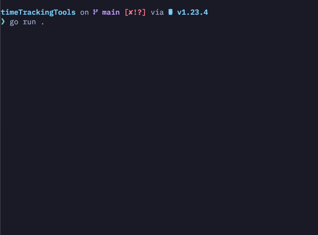

A Go CLI/TUI using Charmbracelet, Bubble Tea, and LipGloss, featuring experimental support for multiple models, views, and components such as tables, lists, and tabs.

Pomodoro Demo with short times

